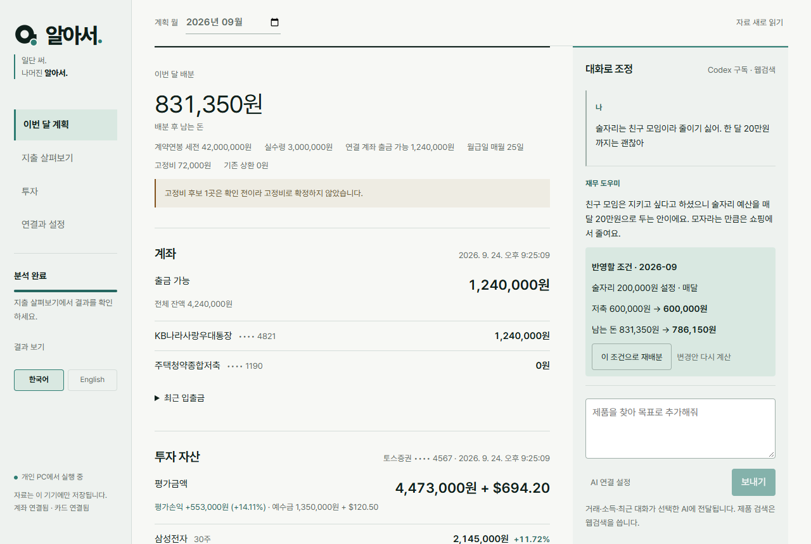
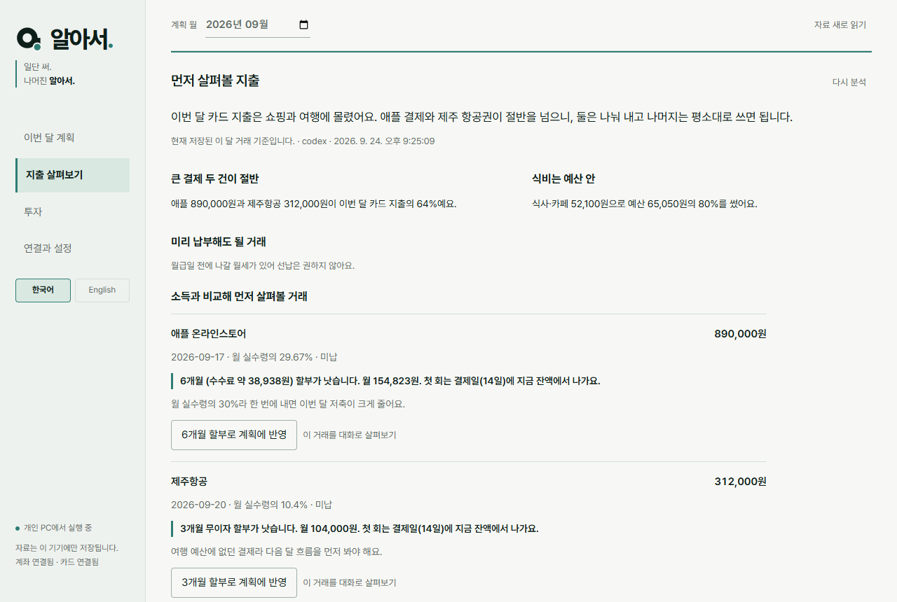
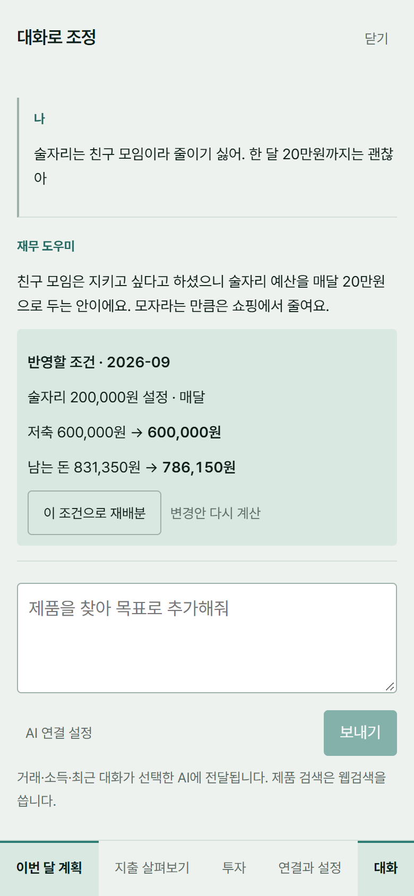
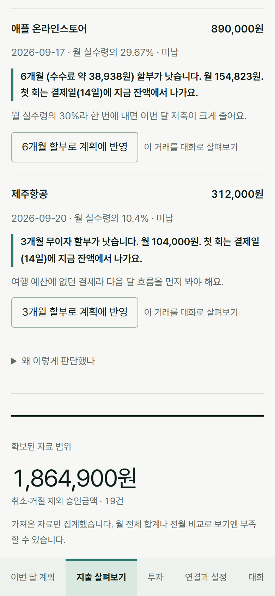
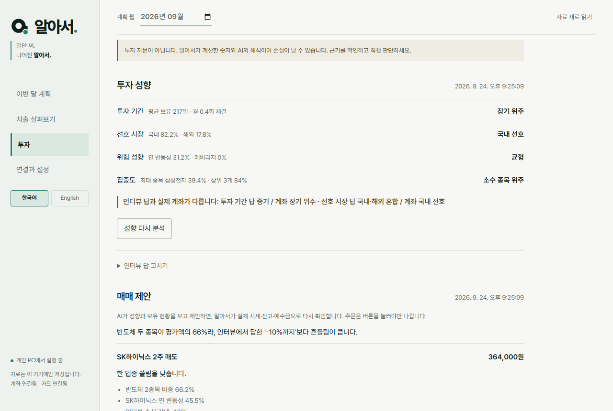
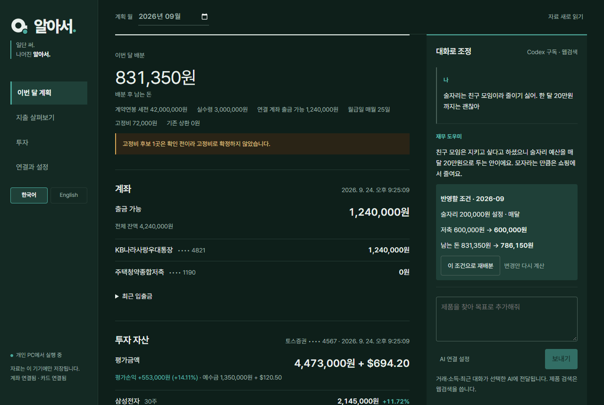

# 알아서

**일단 써. 나머진 알아서.**

월급, 카드값, 통장 잔액, 주식을 한곳에 모아 두고, 내가 쓰는 AI가 "이번 결제는 어떻게 낼지"까지 정리해 주는 개인 재무 도구입니다. 제 돈을 관리하려고 만든 앱이라 서버 없이 내 PC에서만 돌아갑니다.



> 스크린샷은 모두 가상의 데이터로 찍었습니다.

## 왜 만들었나

저는 가계부를 오래 못 쓰는 사람입니다. 카드 세 장에 통장 두 개, 증권 앱까지 흩어져 있다 보니 매달 옮겨 적는 것부터 지쳤습니다.

그런데 정말 필요했던 건 기록보다 판단이었습니다. 이번 달에 얼마 썼는지는 카드 앱에서도 보입니다. 제가 매번 따로 계산해야 했던 건 이런 질문이었습니다.

- 89만 원짜리 결제를 일시불로 해도 되나, 3개월 무이자로 나누는 게 나은가?
- 다음 달 월급으로 내면 이번 달 저축은 얼마나 줄어드나?
- 친구 모임 술값은 줄이고 싶지 않은데, 그러면 다른 데서 얼마를 빼야 하나?

기존 금융 앱은 이미 일어난 일을 잘 보여 주지만, 사람마다 다른 기준까지 반영하긴 어렵습니다. 같은 10만 원도 누구에게는 줄일 돈이고, 누구에게는 꼭 지키고 싶은 생활비니까요. AI에게 평소 말하듯 조건을 알려 주고, 실제 거래와 소득을 근거로 계획을 고치게 하면 이 간격을 줄일 수 있겠다고 생각했습니다.

처음에는 저 혼자 쓰려고 만들었습니다. 써 보니 비슷한 불편을 겪는 사람도 자기 데이터와 자기 AI로 쓸 수 있겠다 싶어서, 제 금융 자료와 인증 정보는 빼고 각자 로컬에서 연결해 쓰는 형태로 공개합니다.

## 만들면서 부딪힌 문제

### 카드사에는 에이전트가 붙을 통로가 없었다

카드사는 개인 에이전트용 API를 주지 않습니다. 웹 로그인은 추가 인증과 세션 만료가 있고, 화면은 언제든 바뀝니다. 그래서 한 가지 방법에 기대지 않고 CODEF 계좌·카드 연결과 거래 파일 가져오기를 함께 둡니다. 검증하지 못한 웹 화면 자동 수집은 된다고 적지 않았습니다.

### 승인내역만으로는 냈는지 안 냈는지 알 수 없었다

승인내역에 거래가 있다고 미납인지 선납했는지 알 수는 없습니다. 즉시결제 목록에서 사라졌다고 납부 완료라고 단정하는 것도 위험했습니다. 그래서 근거가 있을 때만 `납부 확인`으로 표시하고, 나머지는 미납으로 두고 확인하라고 안내합니다.

### 카드와 계좌를 합치면 같은 돈이 두 번 잡혔다

카드 승인 금액과 나중에 통장에서 빠져나간 카드대금은 같은 소비입니다. 둘을 더하면 지출이 부풀어서 역할을 나눴습니다. 카드 내역은 소비 분석에, 계좌 내역은 잔액과 현금 흐름에만 씁니다. 같은 결제가 카드 연동과 직접 올린 파일에 둘 다 있으면 한쪽을 중복으로 표시하고 합계에서 뺍니다.

### AI에게 금액 계산까지 맡기면 매번 답이 달랐다

"저축은 건드리지 말고 생활비만 조금 늘려 줘" 같은 말은 AI가 잘 알아듣습니다. 하지만 할부 개월 수나 배분 금액까지 맡기면 같은 질문에도 결과가 달라졌습니다. 그래서 역할을 갈랐습니다. AI는 의도를 읽고 거래를 분류하고 이유를 씁니다. "3개월 무이자가 낫다" 같은 결론과 금액은 서버가 정해진 규칙으로 계산하고, AI는 그 결론을 뒤집을 수 없습니다. 대화로 한 요청은 바로 저장하지 않고 변경안으로 먼저 보여 줍니다.

### 모델 비용을 누가 낼지가 애매했다

대시보드에 AI를 넣으면 보통 운영자가 API 비용을 내거나 사용자에게 새 API 키를 요구합니다. 개인 프로젝트가 금융 맥락을 중앙 서버에 모으고 비용까지 떠안는 구조는 맞지 않았습니다. 그래서 이미 쓰고 있는 AI를 그대로 연결하게 했습니다.

| 연결 방식 | 쓰는 경우 |
| --- | --- |
| Codex / OpenCodex | 이미 쓰는 ChatGPT 구독 로그인을 그대로 쓰고 싶을 때 |
| OpenAI / Anthropic API | API 키와 모델을 직접 고를 때 |
| MCP | Claude, Codex 같은 외부 AI 앱에서 같은 로컬 자료를 다룰 때 |

구독 한도가 끝났다고 유료 API로 몰래 넘어가지 않습니다.

### 증권 API 키로는 주문까지 할 수 있었다

토스증권 Open API에는 조회 전용 권한이 없어서, 보유 종목만 보려고 발급한 키로도 주문이 됩니다. 그래서 코드에서 막았습니다. 조회는 허용 목록에 있는 경로만 부르고, 주문은 "정수 주 시장가" 한 가지 모양만 통과합니다. 주문이 나가는 곳은 투자 탭에서 내가 누른 제안과 내가 켠 자동 투자 두 군데뿐입니다.

자동 투자는 더 조심했습니다. 내가 맡긴 원금 안에서만 움직이고, 원래 가진 주식은 팔지 않습니다. 손실 한도에 닿으면 스스로 꺼지고, 처음에는 주문을 보내지 않는 모의 실행으로 돕니다.

### 작지만 실제로 겪은 문제들

- **카드 동기화가 통째로 실패했다.** 카드사가 5월 결제의 취소 건을 6~9월 조회 결과에 끼워 보냈고, 날짜 하나가 조회 기간을 벗어나서 전체 저장이 거부됐습니다. 조회 기간 밖의 행만 빼고 저장하게 바꿨습니다.
- **택시 한 번 탔는데 결제가 세 줄이었다.** 카카오T는 가승인 결제가 먼저 잡혔다가 취소되고 실제 요금이 따로 찍힙니다. 취소 건은 장부에 남기되 합계에서는 뺍니다.
- **토큰을 새로 받으면 이전 토큰이 끊겼다.** 토스증권은 키 하나에 유효한 토큰이 하나뿐입니다. 받은 토큰을 만료 전까지 재사용합니다.
- **오류가 "Body is not valid JSON"처럼 나왔다.** 라이브러리 오류 문구는 전부 사람이 읽을 수 있는 한 문장으로 바꿔 보여 줍니다.
- **실제 월급을 넣었는데 "추정 소득 기준"이라고 떴다.** 소득이 정말 추정값일 때만 그 표시를 붙이도록 고쳤습니다.
- **영어로 바꿔도 판정 문장은 한국어로 남았다.** 판정은 분석할 때의 언어로 저장되기 때문이었습니다. 지금은 화면에 보여 줄 때 현재 언어로 다시 씁니다.

## 써 보니 편한 점

### 옮겨 적을 일이 없다

계좌와 카드를 한 번 연결해 두면 정해 둔 시간대에 알아서 가져오고, AI가 분류까지 끝내 둡니다. 저는 앱을 열어서 결과만 봅니다.

### 큰 결제가 생기면 어떻게 낼지가 먼저 온다

소득에 비해 큰 결제가 들어오면 "다음 달 월급으로 내도 됨 / 3개월 무이자가 낫다 / 이번 달 저축을 이만큼 줄이면 일시불 가능" 중 하나로 정리해서 PC나 폰 알림으로 보내 줍니다. 결제일, 무이자 개월, 수수료율은 내 카드 조건으로 바꿀 수 있습니다.



### 예산을 말로 고친다

"술자리는 친구 모임이라 줄이기 싫어. 한 달 20만 원까지는 괜찮아"라고 쓰면 그 조건을 지키면서 다른 항목에서 줄이는 안을 계산해 보여 줍니다. 적용 전후 저축과 남는 돈을 보고 누를지 정하면 됩니다. 화면에서 고칠 수 있는 설정은 대화로도 거의 다 바뀝니다.

| 폰에서 대화로 조정 | 폰에서 큰 결제 판단 |
| --- | --- |
|  |  |

### 추가 비용이 들지 않는다

이미 내고 있는 ChatGPT 구독으로 돌아갑니다. 따로 API 요금을 내지 않아도 분류, 분석, 대화가 다 됩니다.

### 투자도 같은 화면에서, 생활비와는 섞이지 않게

토스증권을 연결하면 보유 종목과 예수금이 계획 화면에 같이 뜹니다. 다만 투자금은 카드값을 낼 수 있는 돈으로 치지 않습니다. 투자 탭에서는 보유 비중, 체결 내역, 60일 시세로 계산한 내 투자 성향을 근거 숫자와 함께 보여 줍니다. 짧은 인터뷰에서 한 답과 실제 계좌가 다르면 그 차이도 짚어 줍니다.



### 밤에도, 폰에서도

다크 모드와 폰 화면을 따로 다듬었습니다. 한국어와 영어도 바로 바꿀 수 있습니다.



## 바로 시작하기

Node.js 24 이상이 필요합니다.

```sh
git clone https://github.com/thisNorm/finance-agent.git
cd finance-agent
npm ci
npm run build
npm start
```

브라우저에서 `http://127.0.0.1:4317`을 엽니다. 첫 화면의 **시작하기** 세 단계를 따라가면 됩니다.

1. **AI 연결**: 설정 탭에서 ChatGPT 구독으로 로그인(Codex CLI 필요)하거나 OpenAI/Anthropic API 키를 넣습니다.
2. **카드·계좌 연결**: CODEF 키를 넣어 여러 계좌와 카드를 연결하거나, 거래 JSON 파일을 올립니다.
3. **월 소득 입력**: 실수령액이나 계약연봉을 적으면 남는 돈과 결제 판단이 계산됩니다.

## 지금 할 수 있는 일

- 세전 연봉으로 예상 실수령액 확인, 실제 월 실수령액으로 교체
- 월급일과 현재 잔액을 반영한 월간 배분
- 카드 승인내역과 계좌 입출금 통합 장부, 조건별 필터
- AI 거래 분류, 지출 흐름 분석, 큰 지출 우선 검토
- 내가 남기고 싶은 소비를 지키는 예산 재배분
- 카드 결제일, 무이자 개월, 수수료율을 반영한 일시불·할부 비교
- 제품 링크, 이미지, 목표 금액, 모은 금액을 담은 구매 목표
- CODEF 다중 계좌·카드 연결과 마스킹된 잔액·입출금·승인내역 동기화
- 토스증권 보유 주식·예수금 조회 (생활비 판단과 분리)
- 보유 종목·체결 내역·60일 시세로 계산한 투자 성향, 짧은 인터뷰, 근거를 붙인 매매 제안
- 맡긴 원금 안에서만 움직이는 자동 투자 (모의 실행 → 실제 주문, 손실 한도·하루 주문 수 제한)
- 지정 시간대 자동 수집, 중복을 막은 PC·ntfy 알림
- 한국어·영어 전환, 다크 모드, 폰 화면
- Codex, OpenCodex, OpenAI API, Anthropic API, MCP 연결

## 실행

`npm start`는 빌드된 화면을 서빙하고, 개발 중에는 `npm run dev`로 소스를 바로 봅니다. DB 위치는 `FINANCE_DB`, 포트는 `PORT`로 바꿀 수 있습니다.

## 자동 수집

계좌, 카드, 토스증권을 연결해 두면 정해진 시간대에 알아서 가져오고 분석까지 돌립니다. 기본은 07시~23시 사이 6시간마다입니다. 설정 탭의 자동 수집에서 바꾸거나, 대화에서 "자동 수집 3시간마다", "밤 10시부터 아침 7시까진 수집하지 마"처럼 말하면 됩니다. 실패하면 한 번 알리고, 같은 오류로 반복해서 알리지 않습니다.

## 대화로 바꿀 수 있는 것

화면에서 고칠 수 있는 건 대화로도 고칠 수 있습니다. 소득·잔액·월급일·카드 결제일·무이자 개월·수수료율, 항목별 예산과 유지 기간, 저축·비상금 잠금, 거래 분류, 고정비 지정, 구매 목표 추가·삭제, 할부 반영·해제, 자동 수집 주기와 시간대, 알림 채널, 자동 투자 켜기·끄기·원금·손실 한도. 모든 변경은 제안 → 확인 → 적용 순서라 말한 대로 바로 저장되지 않습니다. AI 연결, CODEF·토스증권 키는 비밀값이라 대화로 바꾸지 않습니다.

## 알림

- **PC 알림센터**: 기본으로 켜져 있습니다. Windows 토스트, macOS 알림, Linux `notify-send`.
- **폰 푸시**: 설정 탭의 알림에서 ntfy 주제 이름을 적으면 그 주제로 보냅니다. 폰에 ntfy 앱을 깔고 같은 주제를 구독하세요. ntfy는 계정 없이 주제 이름으로만 동작하니 남이 못 맞힐 이름을 쓰고, 원하면 직접 띄운 ntfy 서버 주소를 넣을 수 있습니다.
- 보내는 때: 새로 살펴볼 결제 판단이 생겼을 때, 자동 분석이나 수집이 실패했을 때, 자동 투자가 주문하거나 멈췄을 때. 같은 자료를 다시 분석해도 다시 보내지 않습니다.

## AI 연결

설정 화면에서 연결 방식을 고릅니다.

- Codex 구독은 공식 CLI 설치 후 `ChatGPT로 로그인`을 씁니다. OpenCodex가 실행 중이면 허용된 로컬 프록시를 감지해 그 연결을 씁니다.
- OpenAI와 Anthropic은 API 키와 모델을 직접 고릅니다. API 키는 서버 메모리에만 두며 재시작하면 사라집니다.
- MCP는 설정 화면에서 복사한 stdio 구성을 지원 앱에 등록합니다. 직접 실행하려면 `npm run mcp`를 씁니다.

대화와 분석에는 소득, 계획, 최근 거래가 선택한 AI 제공사로 전달될 수 있습니다. 계좌번호는 끝 4자리만 전달합니다.

## 금융 자료 연결

계좌 조회에는 CODEF Client ID, Client Secret, Public Key가 필요합니다. 인터넷뱅킹 ID, 공동인증서, 빠른조회 중 은행이 지원하는 방식으로 계좌를 등록합니다. 인증 비밀번호와 인증서 파일은 등록 요청이 끝나면 보관하지 않습니다.

카드는 설정 화면에서 카드사를 골라 연결합니다. 여러 카드를 같은 CODEF 연결에 추가할 수 있고, 승인내역과 청구내역은 따로 저장합니다. 카드번호와 승인번호는 분석 화면이나 AI 입력에 넘기지 않습니다.

직접 연결하지 않을 때는 일반 거래 JSON이나 CODEF 응답 파일을 가져올 수 있습니다. 수동 변환 도구는 다음처럼 실행합니다.

```sh
node codef-fetch.cjs 새파일.json
```

필요한 환경변수와 기관별 입력값은 CODEF 발급 정보에 맞춰 직접 설정해야 합니다. 인증값을 소스, 채팅, 커밋에 넣지 마세요.

### 토스증권

1. PC에서 토스증권 웹에 로그인한 뒤 [Open API 화면](https://www.tossinvest.com/open-api/landing)에서 Client ID와 Client Secret을 발급받습니다. 앱이 아니라 웹에서 발급하며, 토스증권 계좌가 있어야 합니다.
2. 같은 화면의 **허용 IP 관리**에 앱을 실행하는 PC의 공인 IP를 등록합니다. 등록하지 않은 IP에서는 모든 호출이 403으로 막힙니다.
3. 알아서 설정 화면의 토스증권 칸에 두 값을 붙여 넣습니다.

키당 유효한 토큰이 하나뿐이라, 같은 키를 다른 도구에서도 쓰면 서로의 토큰을 끊습니다. 알아서 전용 키를 쓰는 편이 좋습니다.

## 투자와 자동 투자

투자 탭은 토스증권을 연결한 뒤 쓸 수 있습니다. 투자 기간, 선호 시장, 위험 성향, 집중도는 서버가 보유 비중, 체결 내역, 60일 변동성으로 계산하고 근거 숫자를 함께 보여 줍니다. 5문항 인터뷰 답이 실제 계좌와 다르면 그 차이를 표시합니다.

매매 제안은 AI가 만들고, 서버가 실시간 시세, 보유 수량, 예수금, 장 운영 시간, 종목 상태(거래정지·레버리지·인버스 제외)로 다시 확인합니다. 통과한 제안에만 주문 버튼이 생기고, 누를 때 한 번 더 확인합니다.

자동 투자는 내가 정한 원금 안에서만 AI가 종목과 횟수를 정합니다. 서버가 지키는 선은 다음과 같습니다.

- 원금 풀에서 산 주식만 팝니다. 원래 가진 주식은 건드리지 않습니다.
- 수량과 금액은 토스 시세로 서버가 다시 계산하고, 남은 현금을 넘는 주문은 막습니다.
- 평가액이 손실 한도 아래로 내려가면 스스로 꺼지고 알림을 보냅니다. 하루 주문 수에도 상한이 있습니다.
- 처음에는 모의 실행으로 돕니다. 실제 주문으로 바꾸면 새 원금으로 다시 시작합니다.
- 환율이나 시세를 못 받으면 추정값으로 판단하지 않고 그 회차를 건너뜁니다.

이 기능은 투자 자문이 아닙니다. 계산된 숫자와 AI의 해석이며, 손실이 날 수 있습니다.

## 데이터와 보안

이 프로젝트는 혼자 쓰는 로컬 앱입니다. 데이터는 기본적으로 `.private/finance.sqlite`에 저장되고 Git과 웹 정적 경로에서 빠집니다. CODEF·토스증권 연결값은 SQLite 옆 암호화 파일에 두며, 계좌번호는 해시 식별자와 끝 4자리로 바꿔 저장합니다.

개발 서버도 `.private`, DB, 키 파일을 내주지 않습니다. `127.0.0.1`에서만 실행하고, 다른 사이트에서 오는 요청과 화면 삽입을 막습니다. 로컬 OS 계정에 연결한 AI 앱은 사용자가 따로 신뢰해야 하는 경계입니다.

## 하지 않는 일

이체, 출금, 카드 결제, 할부 전환은 실행하지 않습니다. 주식 주문은 내가 누르거나 켠 경우에만 나갑니다. 할부 판단은 기본값인 "3개월까지 무이자, 그 이상은 연 15% 수수료" 또는 내가 입력한 카드 조건으로 서버가 계산하고, AI는 그 결론의 이유만 씁니다. 카드사의 실제 행사나 수수료를 자동으로 확인하지는 않으며, 자료가 일부 기간뿐이면 한 달 전체 소비처럼 설명하지 않습니다.

지금은 완성된 금융 서비스라기보다, 실제로 쓰면서 판단 기준을 다듬어 가는 개인 도구입니다. 각자 자기 데이터와 AI를 연결해 써 보고, 필요한 부분은 같이 고쳐 나갔으면 합니다.
